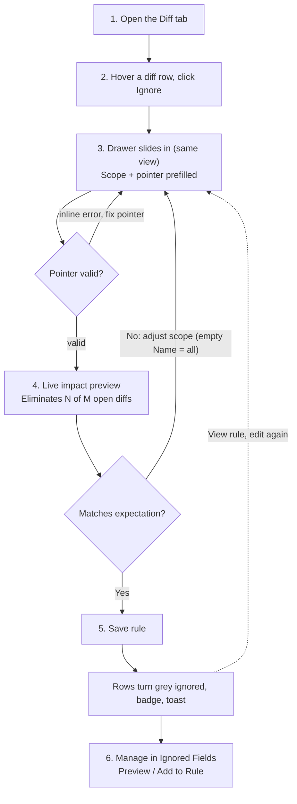

# Argo CD — Ignore-Differences Editor (argoproj/argo-cd#29330)

Assets for the in-UI "ignore differences" editor proposal.

## Vector flow (SVG)

## Annotated flow with UI screenshots

[`ignore-rule-flow.html`](./ignore-rule-flow.html) — step-by-step flow with
prototype screenshots (diff entry → inline drawer with live impact preview →
save feedback → rule management).

## Mermaid (paste directly into GitHub comments)

