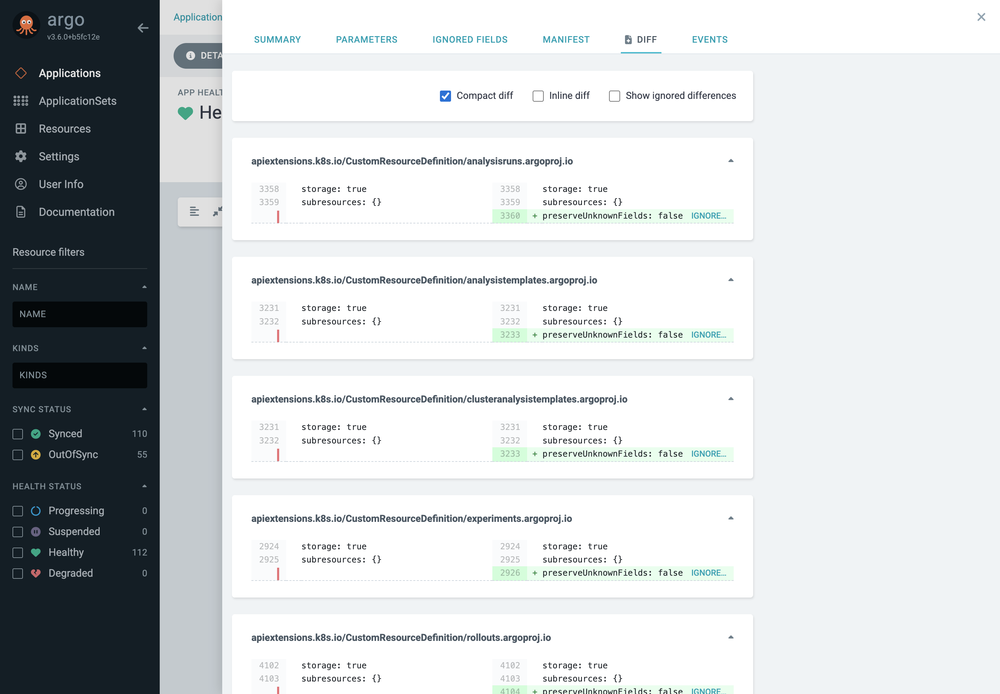
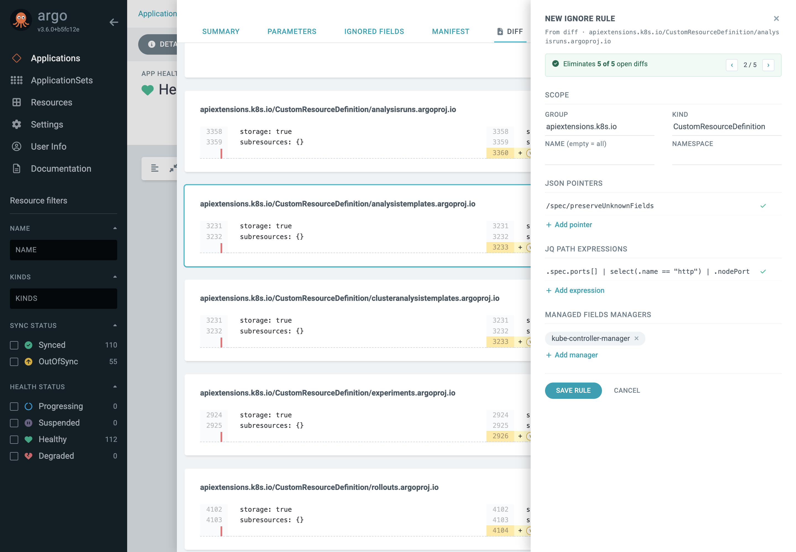
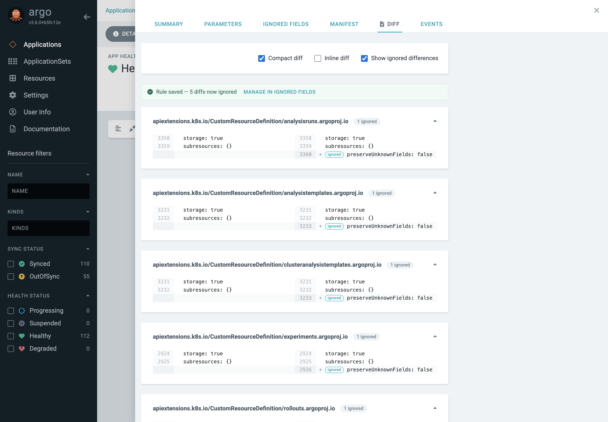
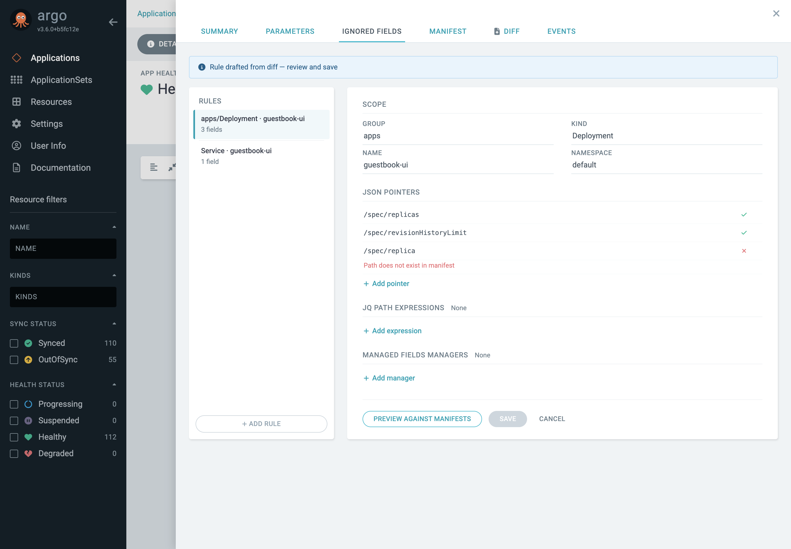
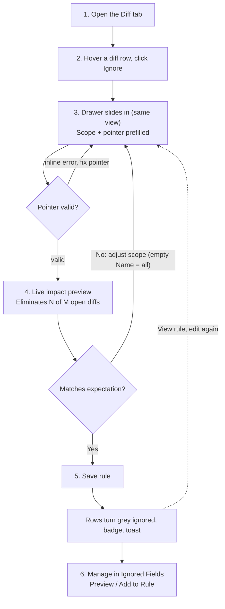

# Argo CD — Ignore-Differences Editor (argoproj/argo-cd#29330)

Assets for the in-UI "ignore differences" editor proposal.
Screenshots live in [`assets/`](./assets) and are referenced from markdown —
reference them the same way in issue comments via their raw URLs.

## Core flow (SVG, vector)

## Step-by-step with UI screenshots

### Steps 1–2 · Diff tab — inline "Ignore…" entry on the added row

### Steps 3–4 · Editor drawer — live impact preview, ‹ n/N › match navigation

Scope and pointer are prefilled from the clicked row; the impact bar and
"will ignore" row highlights update on every keystroke.

### Step 5 · Save — rows turn grey "ignored", card badges, confirmation toast

### Step 6 · Manage in Ignored Fields — rule list, validation, Preview Against Manifests

## Mermaid (paste directly into GitHub comments)

> Note: the SVG keeps no external image references on purpose — GitHub blocks
> external resources inside SVGs rendered as images, so screenshots are plain
> repo files referenced from markdown instead.
