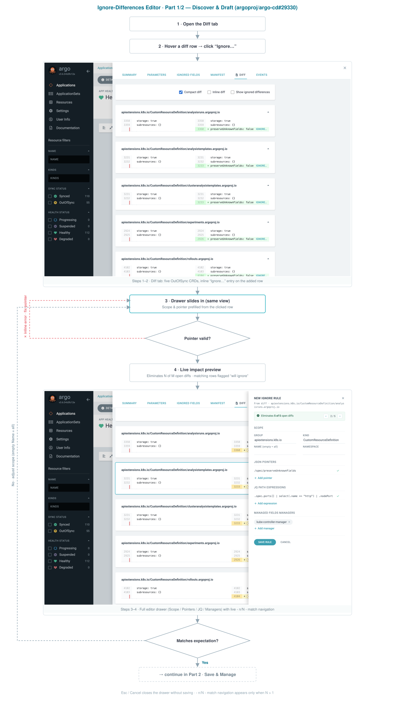
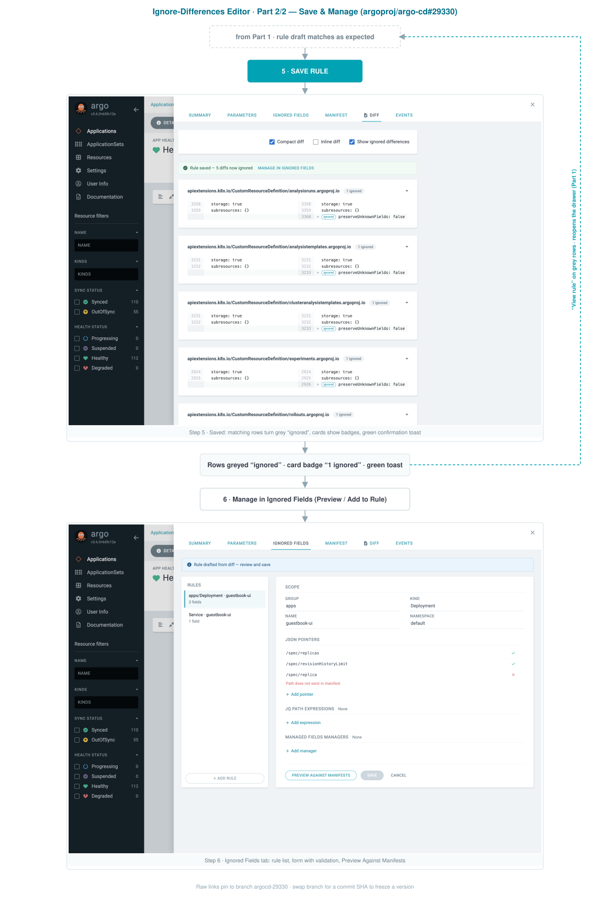
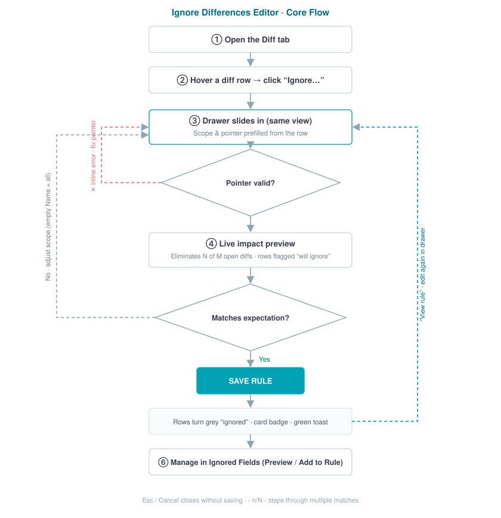
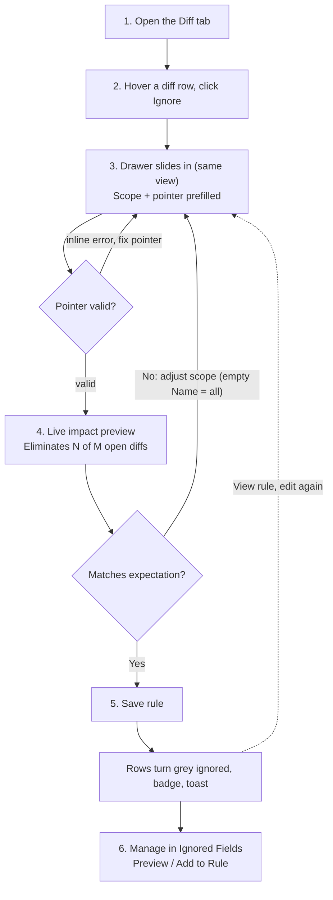

# Argo CD — Ignore-Differences Editor (argoproj/argo-cd#29330)

English-only assets for the in-UI "ignore differences" editor proposal.
The two annotated SVGs below are fully self-contained (screenshots embedded)
— reference either directly in issue comments via its raw URL.

## Part 1/2 — Discover & Draft (steps 1–4, validation & scope loops)

## Part 2/2 — Save & Manage (steps 5–6, "View rule" re-entry)

## Compact flow (nodes only, 5 KB)

## Mermaid (paste directly into GitHub comments)

Raw screenshots (PNG sources) live in [`assets/`](./assets).
