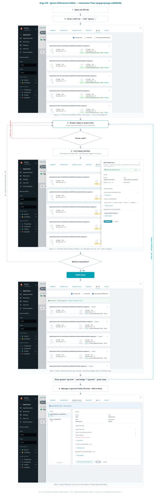
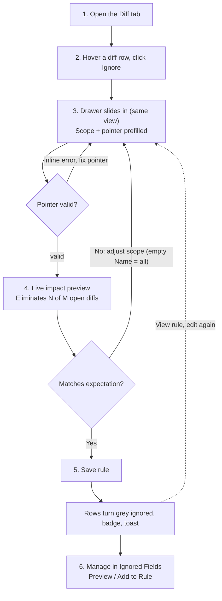

# Argo CD — Ignore-Differences Editor (argoproj/argo-cd#29330)

Assets for the in-UI "ignore differences" editor proposal. English only, SVG only.

## Full annotated flow (embedded UI screenshots)

## Compact flow (nodes only)

## Mermaid (paste directly into GitHub comments)

